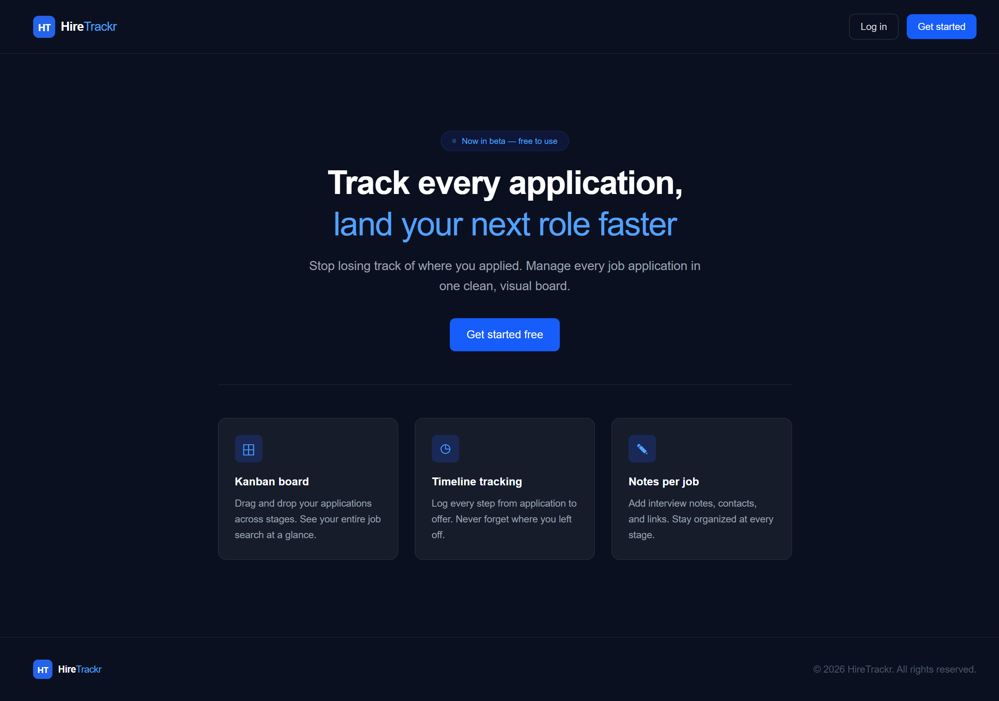
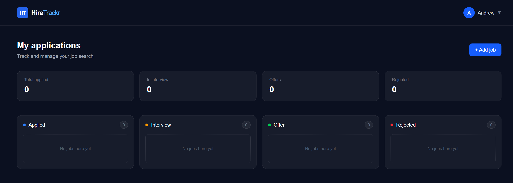

# HireTrackr

> Track every application, land your next role faster.

A full-stack job application tracker with a Kanban board, real-time stats dashboard, and per-application notes. Stop losing track of where you applied — manage your entire job search in one clean, visual board.

🔗 **Live Demo:** [hiretrackr.vercel.app](https://hiretrackr.vercel.app)

---

## Screenshots

### Landing Page


### Dashboard — Kanban Board


---

## Features

- **Kanban Board** — Drag and drop applications across stages: Applied → Interview → Offer → Rejected
- **Stats Dashboard** — Live counts of applications at each stage at a glance
- **Add Applications** — Log jobs with company name, role, and date applied
- **Notes per Job** — Attach interview notes, contacts, and links to each application
- **Timeline Tracking** — Log every step from application to offer, never forget where you left off
- **Firebase Auth** — Secure login and signup, each user sees only their own data
- **Real-time Sync** — Firestore keeps your board updated instantly across devices

---

## Tech Stack

| Layer | Technology |
|---|---|
| Frontend | React 18, TypeScript |
| Styling | Tailwind CSS |
| Auth | Firebase Authentication |
| Database | Firebase Firestore |
| Build Tool | Vite |
| Deployment | Vercel |

---

## Getting Started

```bash
# Clone the repo
git clone https://github.com/AndrewEmad97/HireTrackr.git
cd HireTrackr

# Install dependencies
npm install

# Set up environment variables
cp .env.example .env
# Add your Firebase config values to .env

# Start the dev server
npm run dev
```

### Firebase Setup

1. Create a project at [firebase.google.com](https://firebase.google.com)
2. Enable **Authentication** (Email/Password)
3. Enable **Firestore Database**
4. Copy your Firebase config and add it to `.env`:

```env
VITE_FIREBASE_API_KEY=your_api_key
VITE_FIREBASE_AUTH_DOMAIN=your_auth_domain
VITE_FIREBASE_PROJECT_ID=your_project_id
VITE_FIREBASE_STORAGE_BUCKET=your_storage_bucket
VITE_FIREBASE_MESSAGING_SENDER_ID=your_sender_id
VITE_FIREBASE_APP_ID=your_app_id
```

---

## Project Structure

```
src/
├── components/       # Reusable UI components
├── pages/            # Route-level page components
├── firebase/         # Firebase config and Firestore helpers
├── types/            # TypeScript interfaces and types
└── App.tsx           # Root component and routing
```

---

## Author

**Andrew Emad**  
[GitHub](https://github.com/AndrewEmad97) · [LinkedIn](https://www.linkedin.com/in/andrew-emad-dev/)
